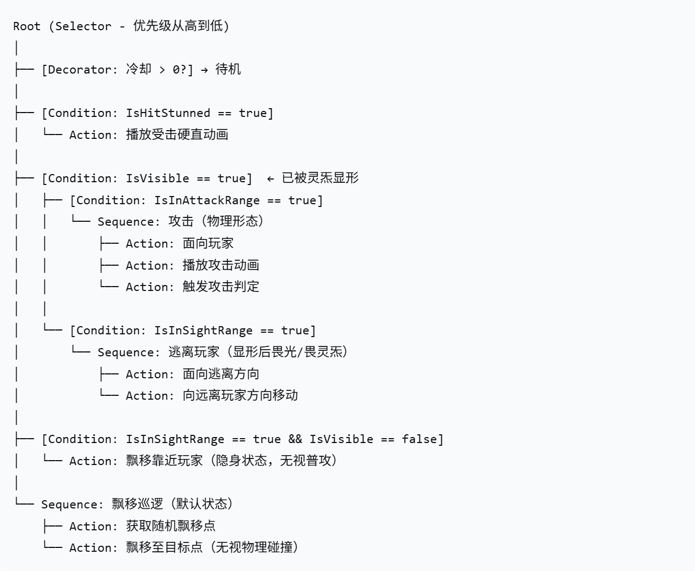

# 《云岫》敌人行为树设计文档

## 一、文档概述

### 1\.1 设计目标

为《云岫》中的阳浊型与阴浊型两类敌人设计行为树AI系统。行为树是定义敌人战斗、移动和反应的标准结构，本设计将确保：

- 两类敌人具有差异化的行为逻辑，强制玩家切换策略应对【4\.2 敌人体系】

- 行为树结构清晰、模块化，便于后续扩展与调参

- 与B（核心玩法程序员）的战斗系统（击退、净化、显形）无缝对接

### 1\.2 敌人类型回顾

根据GDD 4\.2【4\.2 敌人体系：阴阳浊影】：

## 二、行为树节点类型说明

行为树由四种核心节点构成：

### 2\.1 本设计使用的组合节点

- Selector（选择器） ：按优先级从左到右执行子节点，任意一个返回`Success`则停止。用于实现“高优先级行为优先”的逻辑。

- Sequence（序列） ：从左到右依次执行子节点，全部返回`Success`才算成功。用于实现“先A再B”的顺序逻辑。

### 2\.2 执行流程

行为树从根节点开始，每帧（或每固定时间间隔）接收一次 Tick 信号，自上而下、从左到右遍历节点，每个节点返回 `Success` / `Failure` / `Running` 三种状态之一。

## 三、黑板（Blackboard）设计

行为树通过黑板共享数据。以下为敌人AI所需的黑板键值：

## 四、阳浊型敌人行为树设计

### 4\.1 行为树总览（文本结构）

text

Root \(Selector \- 优先级从高到低\)

│

├── \[Decorator: 冷却 \> 0?\] → 待机（等待冷却结束）

│

├── \[Condition: IsHitStunned == true\]  ← 最高优先级：受击硬直

│   └── Action: 播放受击硬直动画（持续1\.5秒）

│

├── \[Condition: IsInAttackRange == true\]

│   └── Sequence: 攻击

│       ├── Action: 面向玩家

│       ├── Action: 播放攻击动画

│       └── Action: 触发攻击判定（调用战斗系统）

│

├── \[Condition: IsInSightRange == true\]

│   └── Sequence: 追击

│       ├── Action: 面向玩家

│       └── Action: 移动至玩家位置（速度参数可调）

│

└── Sequence: 巡逻（默认状态）

├── Action: 获取随机巡逻点

└── Action: 移动至巡逻点

### 4\.2 各节点详细说明

#### 优先级1：待机（冷却装饰器）

#### 优先级2：受击硬直

#### 优先级3：攻击

#### 优先级4：追击

#### 优先级5：巡逻（默认状态）

### 4\.3 阳浊型参数配置表

## 五、阴浊型敌人行为树设计

### 5\.1 行为树总览（文本结构）

### 5\.2 各节点详细说明

#### 核心差异：显形状态（IsVisible）

阴浊型敌人的核心逻辑围绕 `IsVisible` 黑板键展开【GDD 4\.2】：

- `IsVisible == false`（隐身）：青禾普攻完全无效，敌人不受物理伤害

- `IsVisible == true`（显形）：被莹翳灵炁波命中后切换，此时可被青禾攻击

`IsVisible` 由战斗系统在以下时机写入：

- 莹翳释放灵炁波命中阴浊型敌人 → `IsVisible = true`

- 显形后持续 5\~8 秒 → 自动恢复 `IsVisible = false`（重新隐身）

#### 优先级1\-2：待机与受击硬直

同阳浊型（4\.2 优先级1\-2）。

#### 优先级3：显形后攻击

#### 优先级4：显形后逃离

#### 优先级5：隐身飘移靠近

#### 优先级6：飘移巡逻（默认状态）

### 5\.3 阴浊型参数配置表

## 六、与战斗系统的接口约定

### 6\.1 D（系统工具程序员）需向B（核心玩法程序员）提供的接口

### 6\.2 B需向D提供的接口

## 七、附录

### 附录A：节点命名规范（建议）

### 附录B：状态枚举

typescript

*// 敌人状态枚举（供调试面板与B系统使用）*

enum EnemyState 

\{

IDLE,       *// 待机*

PATROL,     *// 巡逻/飘移巡逻*

CHASE,      *// 追击/隐身靠近*

ATTACK,     *// 攻击*

STUN,       *// 受击硬直*

FLEE,       *// 逃离（阴浊型显形后）*

DEAD        *// 死亡*

\}

### 附录C：参考资源

- Cocos Creator行为树实现参考

- 行为树核心概念

- 行为树优先级管理

